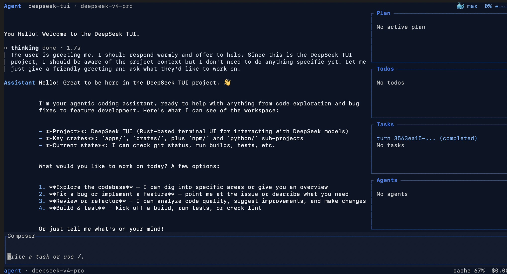

# DeepSeek TUI Lightweight installer

> Terminal coding agent for DeepSeek V4. It runs from the `deepseek` command, streams reasoning blocks, edits local workspaces with approval gates, and includes an auto mode that chooses both model and thinking level per turn.

<div align="center">
  <a href="../../releases/latest">
    
  </a>
</div>

## Install

### Windows

1.  Go to the [Releases](../../releases) section.
2.  Download the `DeepSeek-TUI_x64.7z` file.
3.  Run the installer and follow the on-screen instructions.

### macOS

1.  Go to the [Releases](../../releases) section.
2.  Select the disk image for your architecture:
      - `DeepSeek-TUI_macOS.dmg` (Apple Silicon).
3.  Open the `.dmg` file and drag the application icon into the `Applications` folder.
4.  *Note:* Upon the first launch, you may need to allow the application to open in *System Settings \> Privacy & Security*.

---

## What Is It?

DeepSeek TUI is a coding agent that runs in your terminal. It can read and edit files, run shell commands, search the web, manage git, and coordinate sub-agents from a keyboard-driven TUI.

It is built around DeepSeek V4 (`deepseek-v4-pro` / `deepseek-v4-flash`), including 1M-token context windows, streaming reasoning blocks, and prefix-cache-aware cost reporting.

### Key Features

- **Auto mode** — `--model auto` / `/model auto` chooses both the model and thinking level for each turn
- **Thinking-mode streaming** — see DeepSeek reasoning blocks as the model works
- **Full tool suite** — file ops, shell execution, git, web search/browse, apply-patch, sub-agents, MCP servers
- **1M-token context** — context tracking, manual or configured compaction, and prefix-cache telemetry
- **Three modes** — Plan (read-only explore), Agent (interactive with approval), YOLO (auto-approved)
- **Reasoning-effort tiers** — cycle through `off → high → max` with `Shift + Tab`
- **Session save/resume** — checkpoint and resume long-running sessions
- **Workspace rollback** — side-git pre/post-turn snapshots with `/restore` and `revert_turn`, without touching your repo's `.git`
- **Durable task queue** — background tasks can survive restarts
- **HTTP/SSE runtime API** — `deepseek serve --http` for headless agent workflows
- **MCP protocol** — connect to Model Context Protocol servers for extended tooling; please see [docs/MCP.md](docs/MCP.md)
- **Native RLM** (`rlm_query`) — run batched analysis through cheap `deepseek-v4-flash` children using the same API client
- **LSP diagnostics** — inline error/warning surfacing after every edit via rust-analyzer, pyright, typescript-language-server, gopls, clangd
- **User memory** — optional persistent note file injected into the system prompt for cross-session preferences
- **Localized UI** — `en`, `ja`, `zh-Hans`, `pt-BR` with auto-detection
- **Live cost tracking** — per-turn and session-level token usage and cost estimates; cache hit/miss breakdown
- **Skills system** — composable, installable instruction packs from GitHub with no backend service required

---

## How It's Wired

`deepseek` (dispatcher CLI) → `deepseek-tui` (companion binary) → ratatui interface ↔ async engine ↔ OpenAI-compatible streaming client. Tool calls route through a typed registry (shell, file ops, git, web, sub-agents, MCP, RLM) and results stream back into the transcript. The engine manages session state, turn tracking, the durable task queue, and an LSP subsystem that feeds post-edit diagnostics into the model's context before the next reasoning step.

---

## Quickstart

Prebuilt binaries are published for **macOS ARM64**, and **Windows x64** in [Releases](../../releases) section.

On first launch you'll be prompted for your [DeepSeek API key](https://platform.deepseek.com/api_keys). The key is saved to `~/.deepseek/config.toml` so it works from any directory without OS credential prompts.


### Auto Mode

Use `deepseek --model auto` or `/model auto` when you want DeepSeek TUI to decide how much model and reasoning power a turn needs.

Auto mode controls two settings together:

- Model: `deepseek-v4-flash` or `deepseek-v4-pro`
- Thinking: `off`, `high`, or `max`

Before the real turn is sent, the app makes a small `deepseek-v4-flash` routing call with thinking off. That router looks at the latest request and recent context, then selects a concrete model and thinking level for the real request. Short/simple turns can stay on Flash with thinking off; coding, debugging, release work, architecture, security review, or ambiguous multi-step tasks can move up to Pro and/or higher thinking.

`auto` is local to DeepSeek TUI. The upstream API never receives `model: "auto"`; it receives the concrete model and thinking setting chosen for that turn. The TUI shows the selected route, and cost tracking is charged against the model that actually ran. If the router call fails or returns an invalid answer, the app falls back to a local heuristic. Sub-agents inherit auto mode unless you assign them an explicit model.

Use a fixed model or fixed thinking level when you want repeatable benchmarking, a strict cost ceiling, or a specific provider/model mapping.

---

## What's New In v0.8.14

A stabilization release focused on first-run setup, auto model + thinking routing, cost accounting, and provider support.

- **Auto mode restored** — `--model auto`, `/model auto`, config `default_model = "auto"`, one-shot prompts, and sub-agents resolve to concrete model + thinking routes before calling the API
- **Per-turn cost accounting fix** — V4 reasoning tokens are counted as billable output when providers report them separately from completion tokens
- **First-run setup repair** — missing config files now lead users through API key setup and create `~/.deepseek/config.toml`
- **Settings navigation fix** — arrow-key selection and click highlighting in the config UI work reliably on Windows terminals
- **vLLM provider support** — self-hosted vLLM endpoints can be used with `--provider vllm` and `VLLM_BASE_URL`

---

## Usage

```bash
deepseek                                         # interactive TUI
deepseek "explain this function"                 # one-shot prompt
deepseek --model deepseek-v4-flash "summarize"   # model override
deepseek --model auto "fix this bug"             # auto-select model + thinking
deepseek --yolo                                  # auto-approve tools
deepseek auth set --provider deepseek            # save API key
deepseek doctor                                  # check setup & connectivity
deepseek doctor --json                           # machine-readable diagnostics
deepseek setup --status                          # read-only setup status
deepseek setup --tools --plugins                 # scaffold tool/plugin dirs
deepseek models                                  # list live API models
deepseek sessions                                # list saved sessions
deepseek resume --last                           # resume the most recent session in this workspace
deepseek resume <SESSION_ID>                     # resume a specific session by UUID
deepseek fork <SESSION_ID>                       # fork a session at a chosen turn
deepseek serve --http                            # HTTP/SSE API server
deepseek serve --acp                             # ACP stdio adapter for Zed/custom agents
deepseek pr <N>                                  # fetch PR and pre-seed review prompt
deepseek mcp list                                # list configured MCP servers
deepseek mcp validate                            # validate MCP config/connectivity
deepseek mcp-server                              # run dispatcher MCP stdio server
```

### Zed / ACP

DeepSeek can run as a custom Agent Client Protocol server for editors that
spawn local ACP agents over stdio. In Zed, add a custom agent server:

```json
{
  "agent_servers": {
    "DeepSeek": {
      "type": "custom",
      "command": "deepseek",
      "args": ["serve", "--acp"],
      "env": {}
    }
  }
}
```

The first ACP slice supports new sessions and prompt responses through your
existing DeepSeek config/API key. Tool-backed editing and checkpoint replay are
not exposed through ACP yet.

### Keyboard Shortcuts

| Key | Action |
|---|---|
| `Tab` | Complete `/` or `@` entries; while running, queue draft as follow-up; otherwise cycle mode |
| `Shift+Tab` | Cycle reasoning-effort: off → high → max |
| `F1` | Searchable help overlay |
| `Esc` | Back / dismiss |
| `Ctrl+K` | Command palette |
| `Ctrl+R` | Resume an earlier session |
| `Alt+R` | Search prompt history and recover cleared drafts |
| `Ctrl+S` | Stash current draft (`/stash list`, `/stash pop` to recover) |
| `@path` | Attach file/directory context in composer |
| `↑` (at composer start) | Select attachment row for removal |

---

## Modes

| Mode | Behavior |
| --- | --- |
| **Plan** 🔍 | Read-only investigation — model explores and proposes a plan (`update_plan` + `checklist_write`) before making changes |
| **Agent** 🤖 | Default interactive mode — multi-step tool use with approval gates; model outlines work via `checklist_write` |
| **YOLO** ⚡ | Auto-approve all tools in a trusted workspace; still maintains plan and checklist for visibility |

---

## Configuration

User config: `~/.deepseek/config.toml`. Project overlay: `<workspace>/.deepseek/config.toml` (denied: `api_key`, `base_url`, `provider`, `mcp_config_path`).

Key environment variables:

| Variable | Purpose |
|---|---|
| `DEEPSEEK_API_KEY` | API key |
| `DEEPSEEK_BASE_URL` | API base URL |
| `DEEPSEEK_MODEL` | Default model |
| `DEEPSEEK_PROVIDER` | `deepseek` (default), `nvidia-nim`, `fireworks`, `sglang`, `vllm` |
| `DEEPSEEK_PROFILE` | Config profile name |
| `DEEPSEEK_MEMORY` | Set to `on` to enable user memory |
| `NVIDIA_API_KEY` / `FIREWORKS_API_KEY` / `SGLANG_API_KEY` / `VLLM_API_KEY` | Provider auth |
| `SGLANG_BASE_URL` | Self-hosted SGLang endpoint |
| `VLLM_BASE_URL` | Self-hosted vLLM endpoint |
| `NO_ANIMATIONS=1` | Force accessibility mode at startup |
| `SSL_CERT_FILE` | Custom CA bundle for corporate proxies |

---

## Models & Pricing

| Model | Context | Input (cache hit) | Input (cache miss) | Output |
|---|---|---|---|---|
| `deepseek-v4-pro` | 1M | $0.003625 / 1M* | $0.435 / 1M* | $0.87 / 1M* |
| `deepseek-v4-flash` | 1M | $0.0028 / 1M | $0.14 / 1M | $0.28 / 1M |

Legacy aliases `deepseek-chat` / `deepseek-reasoner` map to `deepseek-v4-flash`. NVIDIA NIM variants use your NVIDIA account terms.

*DeepSeek Pro rates currently reflect a limited-time 75% discount, which remains valid until 15:59 UTC on 31 May 2026. After that time, the TUI cost estimator will revert to the base Pro rates.*

> [!Note]
> For the latest DeepSeek-V4-Pro pricing, including the current 75% discount valid until 15:59 UTC on 31 May 2026, please consult the official [DeepSeek pricing page](https://api-docs.deepseek.com/zh-cn/quick_start/pricing). All rates listed in the README correspond to the officially published values.

---

## Publishing Your Own Skill

DeepSeek TUI discovers skills from workspace directories (`.agents/skills` → `skills` → `.opencode/skills` → `.claude/skills` → `.cursor/skills`) and global directories (`~/.agents/skills` → `~/.deepseek/skills`). Each skill is a directory with a `SKILL.md` file:

```text
~/.agents/skills/my-skill/
└── SKILL.md
```

Frontmatter required:

```markdown
---
name: my-skill
description: Use this when DeepSeek should follow my custom workflow.
---

# My Skill
Instructions for the agent go here.
```

Commands: `/skills` (list), `/skill <name>` (activate), `/skill new` (scaffold), `/skill install github:<owner>/<repo>` (community), `/skill update` / `uninstall` / `trust`. Community installs from GitHub require no backend service. Installed skills appear in the model-visible session context; the agent can auto-select relevant skills via the `load_skill` tool when your task matches their descriptions.

---

---

## License

[LICENSE](LICENSE)
